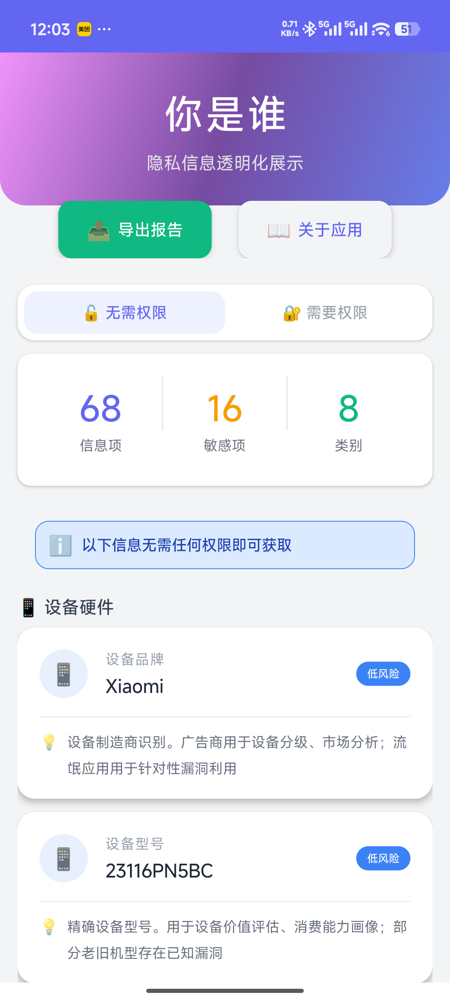
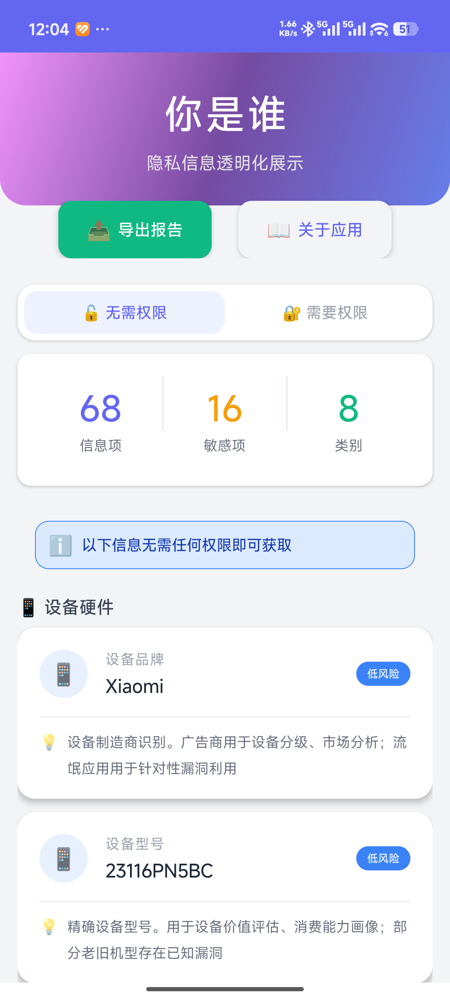
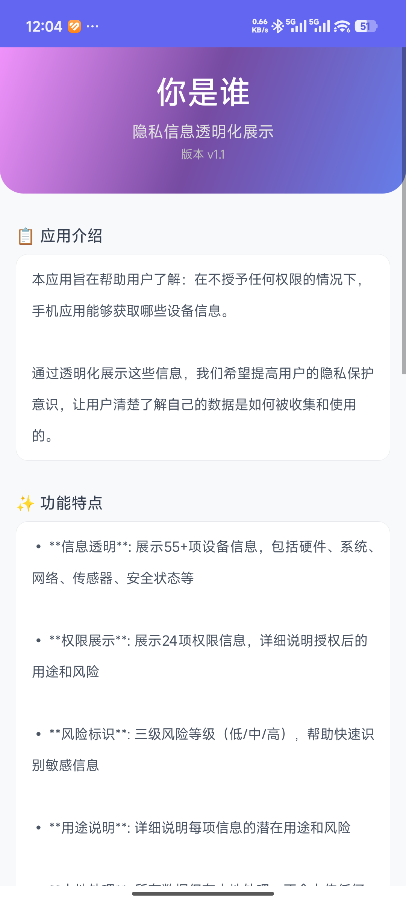

# Who Are You (你是谁)

[](https://opensource.org/licenses/Apache-2.0)
[](https://www.android.com)
[](https://www.java.com)

**Privacy Information Transparency App** - An Android application that demonstrates what information can be obtained from your device without any permissions.

## 📱 Overview

"Who Are You" is an educational Android app that transparently shows users what information can be collected from their smartphones without requiring any special permissions. The app aims to raise awareness about privacy and data security by displaying:

- **55+ items** of device information that can be accessed without permissions
- **24 permission types** with detailed risk descriptions
- Risk level classification for each information item
- Usage scenarios and potential privacy concerns

### 🌐 Language Support

- **Chinese (中文)** - Default language
- **English** - Alternative language (automatically switches based on system language)

## ✨ Features

### 🔓 No Permission Required
Display 55+ items of device information that can be obtained without any permissions:

- **Device Hardware**: Brand, model, CPU cores, memory, battery info
- **System Information**: Android version, SDK version, security patch level
- **Network Information**: IP address, WiFi SSID, BSSID, signal strength
- **Storage Information**: Internal/external storage capacity
- **Display Information**: Screen resolution, density, refresh rate
- **App Environment**: Installed apps count, default browser/launcher
- **Sensor Information**: Accelerometer, gyroscope, proximity sensor
- **Security Status**: Screen lock status, encryption status

### 🔐 Permission Analysis
Detailed analysis of 24 permission types with risk descriptions:

- **Location Permissions**: GPS, network location, background location
- **Communication Permissions**: Contacts, SMS, call logs
- **Media Permissions**: Camera, microphone, media files
- **Device Permissions**: Phone state, IMEI, storage
- **System Permissions**: Calendar, notifications, sensors
- **Special Permissions**: Overlay, clipboard, nearby devices

Each permission includes:
- ✅ Current authorization status
- 📋 Detailed description of what can be accessed
- ⚠️ Risk analysis and potential misuse scenarios

### 🎨 Modern UI Design

- Material Design style with gradient headers
- Card-based layout with smooth animations
- Risk level indicators (High/Medium/Low)
- Clear categorization and navigation
- Export functionality for reports

## 📸 Screenshots

| 首页/无需权限 | 需要权限 | 关于应用 |
|:------------:|:--------:|:--------:|
|  |  |  |

### 首页/无需权限
展示55+项无需任何权限即可获取的设备信息，按类别分类并显示风险等级。

### 需要权限
展示24项权限类型及其详细描述和风险分析，帮助用户了解每项权限能访问的数据及潜在隐私风险。

### 关于应用
提供隐私保护教育信息、技术说明和使用建议。

## 🚀 Installation

### Prerequisites

- Android device with **Android 5.0+** (API 21+)
- **ADB** (Android Debug Bridge) for installation
- Or download APK directly and install

### Build from Source

1. **Clone the repository**
   ```bash
   git clone https://github.com/islon/WhoAreYou.git
   cd WhoAreYou
   ```

2. **Build APK**
   ```bash
   ./gradlew assembleDebug
   ```

3. **Install via ADB**
   ```bash
   adb install -r app/build/outputs/apk/debug/app-debug.apk
   ```

### Direct APK Installation

1. Download the latest APK from [Releases](https://github.com/islon/WhoAreYou/releases)
2. Transfer APK to your Android device
3. Open the APK file and follow installation prompts

## 🛠️ Technical Details

### Architecture

- **Language**: Java
- **Min SDK**: API 21 (Android 5.0)
- **Target SDK**: API 34 (Android 14)
- **Build System**: Gradle

### Data Collection Methods

The app uses standard Android APIs to collect information:

- `Build.*` - Device hardware information
- `Settings.*` - System settings and preferences
- `TelephonyManager` - Network and carrier info
- `ConnectivityManager` - Network connection details
- `WifiManager` - WiFi information
- `PackageManager` - Installed applications
- `ActivityManager` - Memory and process info
- `SensorManager` - Sensor availability

### Permission Checking

- Uses `ActivityCompat.checkSelfPermission()` for permission status
- Handles Android version differences (API 21-34)
- Supports runtime permission model

## 🔒 Privacy & Security

### What This App Does

- ✅ **Local Processing**: All data collection happens on the device
- ✅ **No Upload**: Information is never transmitted to external servers
- ✅ **No Tracking**: No analytics or user tracking
- ✅ **Zero Permissions**: Core functionality requires no special permissions

### What This App Does NOT Do

- ❌ **No Data Collection**: We don't collect any user data
- ❌ **No Network Requests**: No internet connectivity needed
- ❌ **No Background Processes**: Only runs when you open it
- ❌ **No Third-party SDKs**: No advertising or analytics frameworks

## 📖 Educational Purpose

This app is designed for educational purposes to help users understand:

1. **What information** can be accessed without permissions
2. **How this information** could be used by other apps
3. **Privacy implications** of device data accessibility
4. **Best practices** for managing app permissions

### Key Takeaways

- Many apps can access significant device information without asking for permissions
- Device fingerprinting can track users across different apps
- Users should regularly review and manage app permissions
- Understanding data collection helps make informed privacy decisions

## 🤝 Contributing

Contributions are welcome! Please feel free to submit a Pull Request.

### Development Setup

1. Fork the repository
2. Create your feature branch (`git checkout -b feature/AmazingFeature`)
3. Commit your changes (`git commit -m 'Add some AmazingFeature'`)
4. Push to the branch (`git push origin feature/AmazingFeature`)
5. Open a Pull Request

### Areas for Contribution

- 🌍 Additional language translations
- 🎨 UI/UX improvements
- 📱 New information categories
- 🔐 Additional permission types
- 📊 Data visualization features
- 📝 Documentation improvements

## 📝 License

This project is licensed under the Apache License 2.0 - see the [LICENSE](LICENSE) file for details.

```
Copyright 2024 Who Are You Contributors

Licensed under the Apache License, Version 2.0 (the "License");
you may not use this file except in compliance with the License.
You may obtain a copy of the License at

    http://www.apache.org/licenses/LICENSE-2.0

Unless required by applicable law or agreed to in writing, software
distributed under the License is distributed on an "AS IS" BASIS,
WITHOUT WARRANTIES OR CONDITIONS OF ANY KIND, either express or implied.
See the License for the specific language governing permissions and
limitations under the License.
```

## 🙏 Acknowledgments

- Android Open Source Project for providing the platform
- Material Design guidelines for UI inspiration
- Privacy advocates and researchers for motivation

## 📞 Contact & Support

- **Issues**: [GitHub Issues](https://github.com/islon/WhoAreYou/issues)
- **Discussions**: [GitHub Discussions](https://github.com/islon/WhoAreYou/discussions)

---

**⚠️ Disclaimer**: This app is for educational purposes only. The information displayed represents what is technically possible to access without permissions. Always respect user privacy and follow applicable laws and regulations when collecting data.